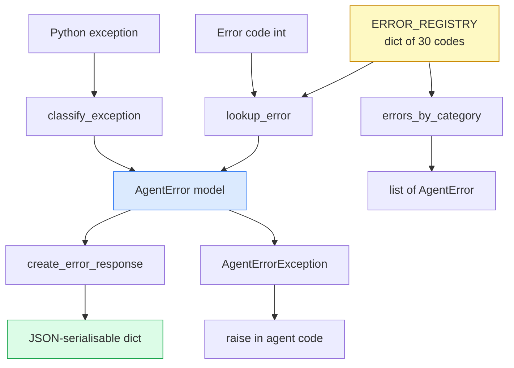

# aumai-error-taxonomy

Standardised error codes and classification for AI agent failures — 6 categories, 30+ codes, Python exception mapping, and structured error responses.

[](https://github.com/aumai/aumai-error-taxonomy/actions)
[](https://pypi.org/project/aumai-error-taxonomy/)
[](LICENSE)
[](https://python.org)

---

## What is this?

Think of a hospital emergency department. Every patient who arrives gets a triage code — a number like P1, P2, P3 — that tells every nurse and doctor exactly how serious the situation is, without them having to re-diagnose the patient from scratch. The code carries shared meaning across the whole organisation.

AI agents fail in diverse ways: the model times out, a tool throws an exception, a security policy blocks an action, a resource budget is exceeded. Without a shared vocabulary, every agent framework invents its own error strings, and any system that consumes those errors — a dashboard, an alerting pipeline, a retry controller — has to handle each framework's idiosyncratic output separately.

**aumai-error-taxonomy** is that shared vocabulary. It defines:

- **30 error codes** across **6 numeric categories** (1xx through 6xx)
- A **Pydantic model** for each error with code, name, description, severity, and retry guidance
- A **lookup function** to resolve any code to its definition
- A **classification function** that maps Python exceptions to the closest agent error
- A **structured error response** builder for consistent JSON error payloads
- A **CLI** to browse, look up, and classify errors from the terminal

---

## Why does this matter?

### The problem from first principles

When an agent fails, three different actors need to understand that failure:

1. **The retry controller** needs to know: can I safely retry this operation, or will retrying make things worse?
2. **The alerting system** needs to know: how urgent is this? Does it wake someone up at 3 a.m.?
3. **The developer** needs to know: what went wrong and where should I look?

If every agent raises `Exception("something went wrong")`, none of these actors can make an informed decision. They would all have to parse free-text error messages — which is fragile, non-portable, and breaks every time the message wording changes.

A numeric taxonomy with defined metadata (severity, retryability) solves all three problems at once. A retry controller looks at `error.retryable`. An alerting system looks at `error.severity`. A developer looks at `error.description`.

### Why 6 categories?

The six categories map to the six independent failure domains in any agent system:

| Range | Category | Domain |
|---|---|---|
| 1xx | `model` | LLM / model provider |
| 2xx | `tool` | Tool execution |
| 3xx | `security` | Auth, permissions, policy, injection |
| 4xx | `resource` | Memory, budget, storage, network |
| 5xx | `orchestration` | Planning, iteration, handoffs |
| 6xx | `data` | Schema, encoding, PII, missing fields |

This mirrors the HTTP status code convention — familiar to every developer — and makes the first digit immediately meaningful.

---

## Architecture



**Data flow:**

1. `ERROR_REGISTRY` is a module-level `dict[int, AgentError]` built at import time from 30 static definitions.
2. `lookup_error(code)` is a direct dict lookup — O(1), no parsing.
3. `classify_exception(exc)` walks an ordered list of `(ExceptionType, code)` pairs using `isinstance()` checks, most-specific first.
4. `create_error_response(error)` builds a JSON-serialisable dict with a UTC timestamp.
5. `AgentErrorException` wraps an `AgentError` into a raise-able Python exception.

---

## Error Codes Reference

### 1xx — Model Errors

| Code | Name | Severity | Retryable |
|---|---|---|---|
| 101 | `model_not_found` | high | No |
| 102 | `model_context_overflow` | medium | No |
| 103 | `model_timeout` | high | Yes |
| 104 | `model_rate_limit` | medium | Yes |
| 105 | `model_output_parse_error` | medium | Yes |
| 106 | `model_output_truncated` | medium | Yes |

### 2xx — Tool Errors

| Code | Name | Severity | Retryable |
|---|---|---|---|
| 201 | `tool_not_found` | high | No |
| 202 | `tool_invocation_error` | high | Yes |
| 203 | `tool_input_validation_error` | medium | No |
| 204 | `tool_timeout` | high | Yes |
| 205 | `tool_output_schema_mismatch` | medium | No |

### 3xx — Security Errors

| Code | Name | Severity | Retryable |
|---|---|---|---|
| 301 | `auth_failed` | critical | No |
| 302 | `permission_denied` | critical | No |
| 303 | `policy_violation` | critical | No |
| 304 | `injection_detected` | critical | No |
| 305 | `sandbox_escape_attempt` | critical | No |

### 4xx — Resource Errors

| Code | Name | Severity | Retryable |
|---|---|---|---|
| 401 | `resource_exhausted` | high | Yes |
| 402 | `budget_exceeded` | high | No |
| 403 | `storage_quota_exceeded` | medium | No |
| 404 | `network_unreachable` | high | Yes |
| 405 | `disk_write_error` | high | Yes |
| 406 | `connection_pool_exhausted` | high | Yes |

### 5xx — Orchestration Errors

| Code | Name | Severity | Retryable |
|---|---|---|---|
| 501 | `max_iterations_exceeded` | high | No |
| 502 | `plan_parse_error` | medium | Yes |
| 503 | `dependency_cycle_detected` | high | No |
| 504 | `handoff_failed` | high | Yes |

### 6xx — Data Errors

| Code | Name | Severity | Retryable |
|---|---|---|---|
| 601 | `data_schema_violation` | medium | No |
| 602 | `data_not_found` | medium | No |
| 603 | `data_corruption` | high | No |
| 604 | `pii_detected` | critical | No |
| 605 | `encoding_error` | medium | No |
| 606 | `missing_required_field` | medium | No |

---

## Features

| Feature | Description |
|---|---|
| **30 pre-defined error codes** | Six categories covering every agent failure domain |
| **Pydantic models** | Every error is a typed `AgentError` with validated fields |
| **O(1) lookup** | `lookup_error(code)` is a direct dict lookup |
| **Exception classification** | `classify_exception(exc)` maps Python exceptions to agent errors, most-specific match first |
| **Structured responses** | `create_error_response()` builds a JSON-safe dict with UTC timestamp |
| **Raise-able wrapper** | `AgentErrorException` lets you raise an error with full metadata attached |
| **Category filtering** | `errors_by_category()` returns all errors in a category, sorted by code |
| **CLI** | `list`, `lookup`, `classify` subcommands with colour-coded terminal output |

---

## Quick Start

### Install

```bash
pip install aumai-error-taxonomy
```

### Python in 30 seconds

```python
from aumai_error_taxonomy import lookup_error, classify_exception, create_error_response

# Look up a known error code
error = lookup_error(103)
print(error.name)         # "model_timeout"
print(error.retryable)    # True
print(error.severity)     # "high"

# Map a Python exception to an agent error
try:
    raise TimeoutError("model did not respond")
except TimeoutError as exc:
    agent_error = classify_exception(exc)
    print(agent_error.code)   # 103
    response = create_error_response(agent_error, details=str(exc))
```

### CLI in 30 seconds

```bash
# List all error codes
aumai-error-taxonomy list

# Filter by category
aumai-error-taxonomy list --category security

# Look up a specific code
aumai-error-taxonomy lookup 304

# Classify a Python exception type
aumai-error-taxonomy classify TimeoutError
```

---

## CLI Reference

### `aumai-error-taxonomy list [--category CATEGORY] [--json]`

List all registered error codes.

```bash
aumai-error-taxonomy list
aumai-error-taxonomy list --category model
aumai-error-taxonomy list --category security --json
```

| Option | Default | Description |
|---|---|---|
| `--category`, `-c` | none | Filter by category: `model`, `tool`, `security`, `resource`, `orchestration`, `data` |
| `--json` | `False` | Output as a JSON array instead of a table |

---

### `aumai-error-taxonomy lookup CODE [--json]`

Look up a specific error by its numeric code.

```bash
aumai-error-taxonomy lookup 304
aumai-error-taxonomy lookup 503 --json
```

Exits with code `1` if the code is not registered.

---

### `aumai-error-taxonomy classify EXCEPTION_NAME [--json]`

Classify a Python exception type name to the closest agent error.

```bash
aumai-error-taxonomy classify TimeoutError
aumai-error-taxonomy classify PermissionError
aumai-error-taxonomy classify ConnectionRefusedError --json
```

Unknown exception names fall back to `ValueError` classification (601).

---

## Python API Examples

### Look up a code

```python
from aumai_error_taxonomy import lookup_error, UnknownErrorCode

try:
    error = lookup_error(304)
    print(f"{error.code}: {error.name}")   # "304: injection_detected"
    print(f"Severity: {error.severity}")    # "critical"
    print(f"Retryable: {error.retryable}")  # False
except UnknownErrorCode:
    print("Code not registered")
```

### Get all errors in a category

```python
from aumai_error_taxonomy import errors_by_category
from aumai_error_taxonomy import ErrorCategory

security_errors = errors_by_category(ErrorCategory.security)
for err in security_errors:
    print(f"  {err.code}: {err.name} [{err.severity}]")
```

### Classify Python exceptions

```python
from aumai_error_taxonomy import classify_exception

exceptions_to_test = [
    TimeoutError("timed out"),
    PermissionError("access denied"),
    FileNotFoundError("no such file"),
    MemoryError("out of memory"),
    ConnectionRefusedError("connection refused"),
    ValueError("bad value"),
]

for exc in exceptions_to_test:
    error = classify_exception(exc)
    print(f"{type(exc).__name__:30s} -> [{error.code}] {error.name}")
```

### Build a structured error response

```python
from aumai_error_taxonomy import lookup_error, create_error_response
import json

error = lookup_error(502)
response = create_error_response(error, details="Could not parse step 3 of the plan")
print(json.dumps(response, indent=2))
# {
#   "error": {
#     "code": 502,
#     "name": "plan_parse_error",
#     "category": "orchestration",
#     "description": "The agent's plan or task decomposition could not be parsed.",
#     "severity": "medium",
#     "retryable": true,
#     "details": "Could not parse step 3 of the plan",
#     "timestamp": "2026-02-27T10:00:00+00:00"
#   }
# }
```

### Raise an AgentErrorException

```python
from aumai_error_taxonomy import lookup_error, AgentErrorException

def call_model(prompt: str) -> str:
    # ... model call ...
    raise AgentErrorException(
        lookup_error(103),
        details="Response not received within 30 seconds",
    )

try:
    call_model("Summarise this text")
except AgentErrorException as exc:
    print(exc.error.code)      # 103
    print(exc.error.retryable) # True
    print(exc.details)         # "Response not received within 30 seconds"
    if exc.error.retryable:
        # schedule a retry
        pass
```

### Use the ERROR_REGISTRY directly

```python
from aumai_error_taxonomy import ERROR_REGISTRY

# Inspect all retryable errors
retryable = [e for e in ERROR_REGISTRY.values() if e.retryable]
print(f"{len(retryable)} retryable errors")

# All critical-severity errors
critical = [e for e in ERROR_REGISTRY.values() if e.severity == "critical"]
for err in sorted(critical, key=lambda e: e.code):
    print(f"  {err.code}: {err.name}")
```

---

## How it Works

### Exception classification order

`classify_exception()` iterates an ordered list of `(ExceptionType, error_code)` pairs and returns the first match via `isinstance()`. The list is ordered most-specific first — `ConnectionRefusedError` and `ConnectionResetError` appear before `ConnectionError` because they are subclasses of it. This ensures the most precise mapping is always selected.

If no exception type matches, the function falls back to error 601 (`data_schema_violation`) as the most neutral generic error.

### Registry construction

`ERROR_REGISTRY` is built at module import time by iterating `_RAW_ERRORS` (a list of 30+ dicts) and calling `AgentError.model_validate()` on each. The result is a `dict[int, AgentError]` keyed by numeric code. Lookup is O(1).

---

## Integration with Other AumAI Projects

- **aumai-agentsmd** — Parse validation errors and surface them as structured `AgentError` objects using `classify_exception()`.
- **aumai-policycompiler** — Map `PolicyValidationError` to code 303 (`policy_violation`) for consistent error payloads.
- **Agent runtimes** — Call `create_error_response()` in exception handlers to produce consistent, machine-readable error JSON for any observability pipeline.

---

## Contributing

1. Fork and create a branch: `feature/your-feature`
2. Install dev dependencies: `pip install -e ".[dev]"`
3. Run tests: `make test`
4. Run lint: `make lint`
5. Open a pull request with a conventional commit title

See `CONTRIBUTING.md` for the full guide.

---

## License

Apache 2.0 — see `LICENSE` for the full text.

---

## Part of AumAI

This project is part of [AumAI](https://github.com/aumai) — open source infrastructure for the agentic AI era.
